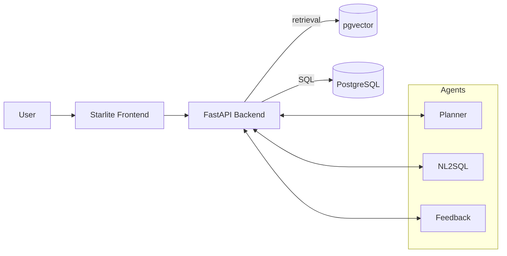

# NL2SQL-LangGraph ✨🧠➡️🗃️➡️📊

Ask questions in natural language and get executable SQL, results, and beautiful reports — powered by LangGraph/LangChain, FastAPI, Starlite, and PostgreSQL + pgvector.

- 🤖 NL→SQL agents with planning, feedback, and RAG context
- 🧰 Vector search on `pgvector` tables you control
- ⚡ FastAPI backend + Starlite micro frontend
- 🐳 1‑command Docker Compose for full stack (DB, pgAdmin, backend, frontend)
- 🧾 One‑click PDF report generation (WeasyPrint fallback)

## How It Works

1) You ask a question in plain English/Spanish.
2) The system retrieves relevant context from your vector store (pgvector).
3) Agents plan, draft SQL, and self‑review the query.
4) The backend executes SQL against Postgres and shows the results in the UI.
5) Optionally, generate a polished Markdown/PDF report summarizing insights.

## Quickstart (Docker Compose) 🐳

Prereqs: Docker Desktop or Docker Engine + Compose.

1) Create your env file
   - Copy `.env.example` to `.env` and set `OPENAI_API_KEY`.
2) Start the stack
   - `./architecture/start_all.sh up`
3) Open the apps
   - Frontend: `http://localhost:3000`
   - Backend health: `http://localhost:8001/healthz`
   - pgAdmin (optional): `http://localhost:5050`

Stop services any time with: `./architecture/start_all.sh down`

## Running Locally (without Docker) 🛠️

Prereqs: Python 3.12, Postgres with `pgvector` extension.

- Install requirements:
  - Backend: `pip install -r requirements.txt`
  - Frontend: `pip install -r requirements/frontend.txt`
- Export env vars (or copy `.env.example` to `.env`).
- Start backend: `uvicorn api.app:app --reload --port 8001`
- Start frontend: `uvicorn starlite_app:create_app --factory --reload --port 3000`

## API Overview 🔌

- `GET /healthz` – service and DB health
- `GET /vector_databases` – list available vector tables
- `POST /compute_vectors` – embed raw text into vectors
- `POST /text_to_vectordb` – embed and store text in a pgvector table
- `POST /agents_chat` – run NL→SQL flow and return the agent messages
- `POST /execute_query` – run SQL over Postgres and return rows/columns
- `POST /generate_report` – return Markdown report
- `POST /generate_report_pdf` – return a downloadable PDF
- `POST /upload_md` – upload a Markdown file and store its embeddings
- `WS /ws/agents_chat` – streaming agent messages over WebSocket

## Project Structure 🗂️

- `src/api/` – FastAPI app, schemas and services
- `src/starlite_app/` – Starlite micro UI (templates + routes)
- `src/langchain_app/` – LangChain/LangGraph orchestration and vector store
- `databases/` – SQL for demo datasets and `pgvector` init scripts
- `architecture/` – Dockerfiles, Compose, and helper scripts
- `requirements/` – pinned dependencies for backend/frontend

Note: `src/agents_chat.py` is a legacy Autogen prototype kept for reference.

## Configuration ⚙️

Use environment variables or `.env`:

- OpenAI: `OPENAI_API_KEY`
- Models: `GPT_MODEL`, `GPT_EMBEDDING_ENGINE`
- Postgres: `POSTGRES_HOST`, `POSTGRES_PORT`, `POSTGRES_USER`, `POSTGRES_PASSWORD`, `POSTGRES_DB`
- Vector: `PGVECTOR_TABLE`, `PGVECTOR_DIMENSIONS`, `PGVECTOR_TOP_K`

See `.env.example` for a complete list and defaults.

## Development Tips 🧑‍💻

- Keep large binaries out of Git (zips, datasets). Add to `.gitignore`.
- Use the Docker stack for a consistent local environment.
- pgvector demo tables are created from `databases/_initdb/*.sql`.

## Roadmap 🗺️

- [ ] Auth and multi‑tenant databases
- [ ] Richer UI with history and saved reports
- [ ] Built‑in dataset loader and schema explorer

## License 📄

This project is released under the MIT License. See `LICENSE`.

— Enjoy exploring data with natural language! ✨
